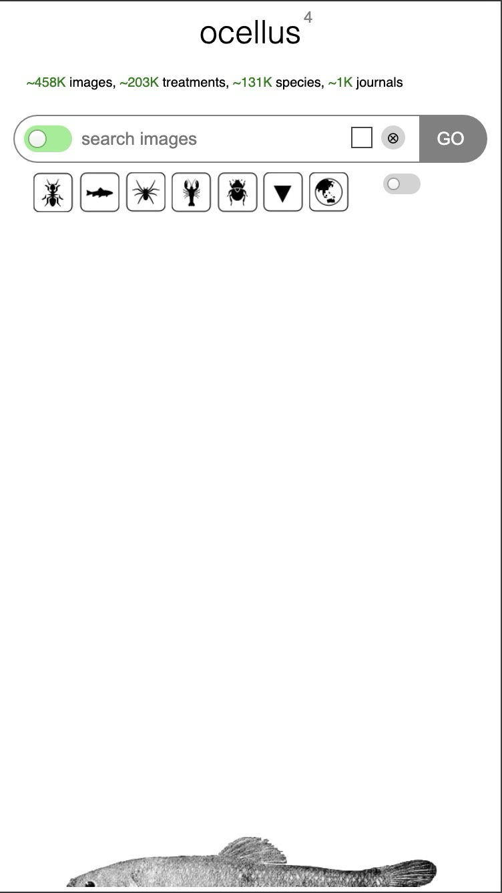
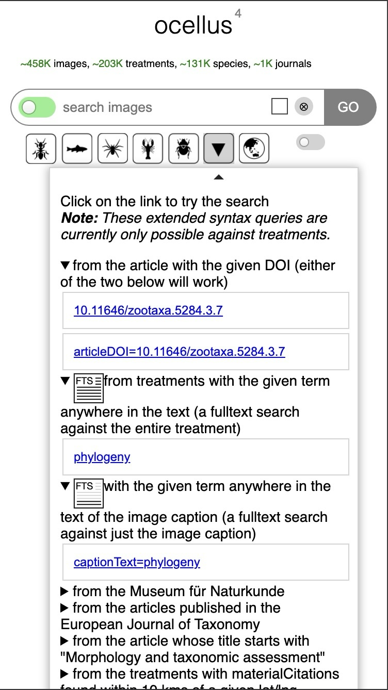
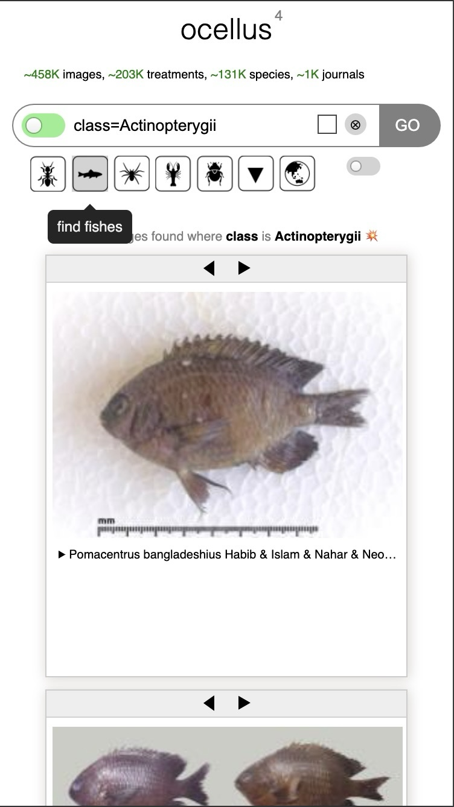

# ocellus

*eye see you*

A simple interface to the images in the [Biodiversity Literature Repository](https://biolitrepo.org) (BLR) built upon [Zenodeo](http://zenodeo.punkish.org), the `nodejs` API to the [Zenodo API](https://zenodo.org/api).

<figure>
    
    <figcaption>
        <ol>
            <li>switch controls source of images: all, Zenodo, or treatments</li>
            <li>click to reveal example searches that can be performed</li>
        </ol>
    </figcaption>
</figure>

<figure>
    
    <figcaption>
        <ol start="3">
            <li>Syntax of example searches. Click on 'try this search' to insert search in the input field above, then click [go] to perform search.</li>
        </ol>
    </figcaption>
</figure>

<figure>
    
    <figcaption>
        <ol start="4">
            <li>Switch flips source to 'treatments' when there is an extended syntax query in the input field. For now, extended querying is only possible for treatments. For searching images on Zenodo or on both Zenodo and treatments, do a simple query search that performs a full-text search on all the records.</li>
            <li>Extended query search for images from records that contain the word 'tyrannosaurus' and who 'authorityName' starts with 'osborn'</li>
            <li>Click record id link to reveal figure caption and further links</li>
        </ol>
    </figcaption>
</figure>

<figure>
    
    <figcaption>
        <ol start="7">
            <li>There is a [T] in the top left of the image if the image is from a treatment. Click the [T] to reveal the 'treatmentId'</li>
            <li>Links to the record on Zenodo and on TreatmentBank.</li>
        </ol>
    </figcaption>
</figure>